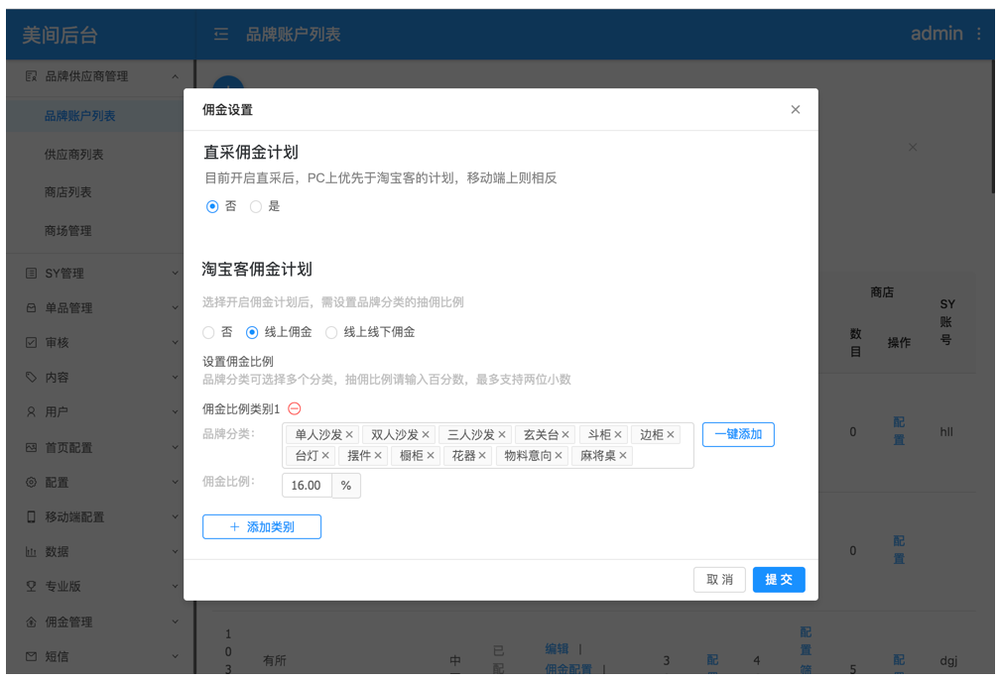

# 4.1 后台配置佣金计划

## 4.1.1 配置佣金计划且与原来的计划不互斥（P0）

**功能模块**：CMS

**功能描述**：支持开启直采佣金，同时不影响品牌原来的线上佣金，pc上优先于淘宝客计划（线上佣金/线上线下佣金）；线上佣金计划和直采佣金计划需要同时成立。

**需求描述**：直采类型的佣金计划，暂不支持移动端。因此佣金计划需要支持移动端和PC中，一个品牌同时有两套佣金计划。在移动端支持私信和直采之前，原淘宝客链接依旧进行。即后台配置中，直采计划和淘宝客佣金计划都可以使用。（以后，佣金计划中的不同类型是互斥的，使用直采类型的话，原来的淘宝客转链接功能停止，重新开就重新转。）

**交互**： 点击“提交”时生效直采佣金计划。

**前置条件：**该品牌没有开启“无价格“

**demo**：

## 4.1.2 配置直采佣金计划的采购价格（P1）

**功能模块**：CMS

**功能描述**：开启佣金计划后，再次进入佣金设置，出现点击配置按钮；配置时，要求将采购价格到每个单品维度上。列表中支持批量按当前价格比例计算配置采购价格或单独修改。同时支持修改单品价格。

**前置条件**：品牌开启了直采佣金计划。

具体描述：

* 列表中单品每次请求50个数据，展示50个，页码翻页。只出现不是旧款的单品。
* 查找单品：

             A. 通过分类筛选单品，列表中包含全部+该品牌下所有单品等分类。

             B.  通过通过单品名称或ID查找单品。

            C. 选择A或输入B后，点击查找按钮进行查找。查找结果是前面条件的交集。

* 修改单品采购价：

    点击单品的采购价格 进行修改，支持小数点后两位。

* 多选： 

勾选或全选列表内容时，支持通过当前价格 ，输入一个比例后，计算出采购价格。

输入比例支持输入框外自带百分比，支持输入\(0,100\)之间的整数。

**计算公式：采购价格=当前单品的价格\*输入的数字/100**

* 修改单品价格：

点击价格可以输入修改，支持大于等于0的两位小数点的数字。

* 交互：

点击提交时，提交本次弹窗中所有修改结果

* 单品列表信息：

展示后台品牌单品列表中的字段即可。链接必要。

* 展示计算获得的佣金比例

| 佣金比例=\[单品价格\*（1-1/1.03\*0.03\*1.12\)-采购价\]\*\(1-美间直采抽佣比例）/单品价格 |
| --- |

**demo：**

* 产品价格和采购价格修改后的影响：只对新订单产生影响
* 未输入采购价的单品 或采购价输入为0的单品，默认不参与采购价格，当采购价输入0时，采购价恢复为“--“，佣金比例展示为“--“，单品不返佣。提交时，采购价为0的提交为没有开启直采的单品。

## 4.1.3从品牌进入-后台单品列表修改单品价格功能关闭

**功能模块**：CMS

**功能描述**：开启直采的单品列表中 后台前端不可修改单品价格。 必须到佣金配置的页面中修改。

**前置条件：**品牌开启了直采佣金计划。

## 4.1.1 佣金计划筛选的地方都补充 筛选直采计划

**功能模块**：CMS

**功能描述**：补“直采计划“这个选项

* 筛品牌的时候， 结果是直采计划开启的就出现
* 筛订单时，直接筛来自直采的订单

demo：

