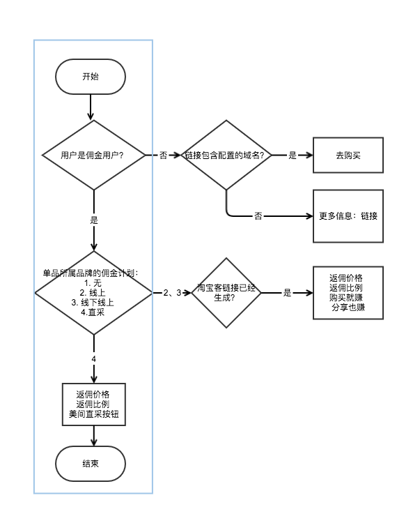
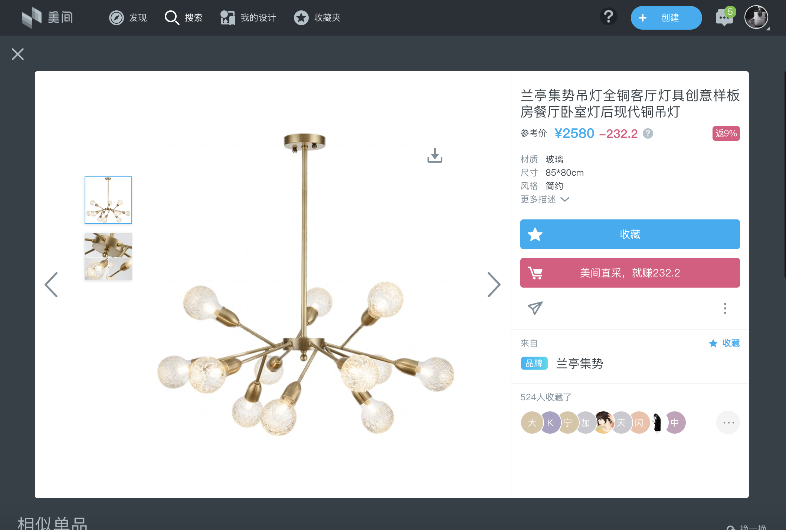
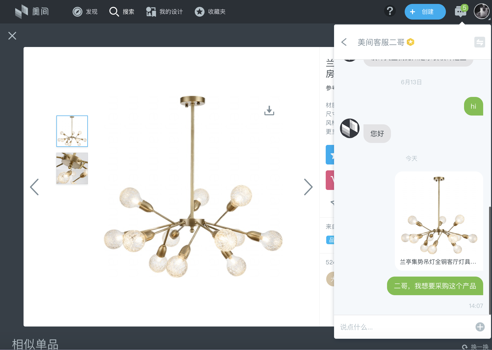

# 4.2 单品详情、列表加采购按钮

## 4.2.1 单品详情加采购按钮（P0）

**功能模块** ：Web

**功能描述**：在单品详情页中，对符合条件的单品，向符合条件的用户，展示美间直采这个按钮。

**button文案**：美间直采，就赚XXXX  （填入佣金具体计算金额）

| 佣金计算金额=单品价格\*单品返佣比例 |
| --- |

**前置条件**：用户是佣金用户，且 单品所属于的品牌佣金计划中直采类型开启。

**流程图**：

**demo**：

## 4.2.2 点击直采按钮触发私信（P0）

**功能模块**：Web

**功能描述**：在单品详情页中，当用户点击美间直采这个按钮时，发送当前单品给当前指定客服，并打开私信对话窗口。单品后自动跟发消息“二哥，我想采购这个产品。“

**前置条件**：

1. 用户可以看到直采按钮
2. 用户云信功能正常，不属于私信黑名单用户

**异常描述**：

1. 私信黑名单用户发送失败：toast提示内容为原黑名单提示
2. 私信功能不正常等导致发送失败：toast提示系统异常

**风险控制：**

1. 前端页面上多次点击只发送最后一次信息
2. 运营手工配置私信黑名单

**demo**：

## 4.2.3 客服设置（P1）

* 该客服手机号为：13777402783
* 将该客服账号设置为认证设计师用户，认证文案为客服。
* 取消该客服账号3条消息回复和发送限制。

## 4.2.4 私信自动回复（P1）

* 该客服账号要求能对私信进行自动回复，机器人消息设置等。

## 4.2.5 搜索列表/收藏列表等佣金比例的展示（P1）

**功能模块** ：Web

**功能描述：**

* 当用户为佣金用户时，单品列表中出现的佣金比例展示直采计算的佣金比例
* 需要的列表有：外边和侧边的，项目和拼图详情下的单品结果列表 、单品搜索下的单品搜索结果列表、全局搜索下的单品结果列表、用户详情页下的单品列表、收藏夹的单品列表。
* 样式不改。

