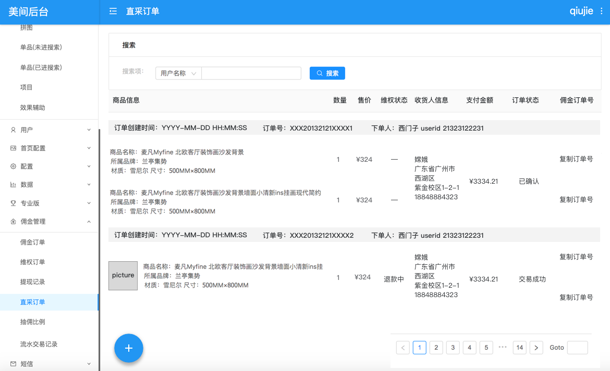
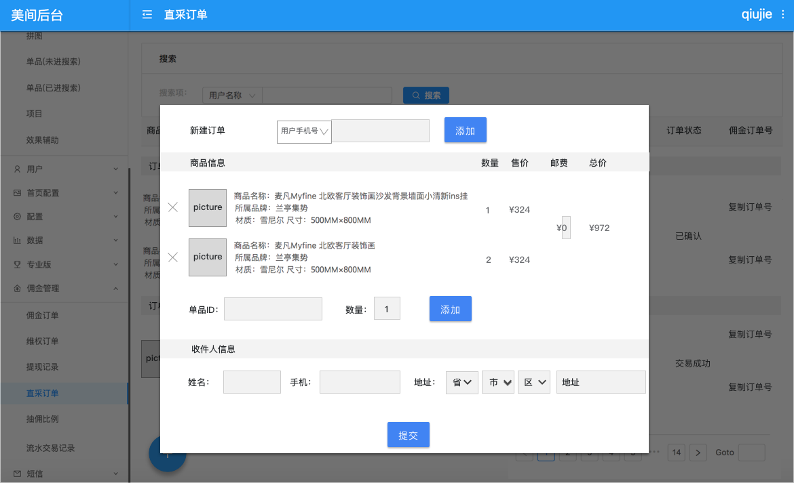
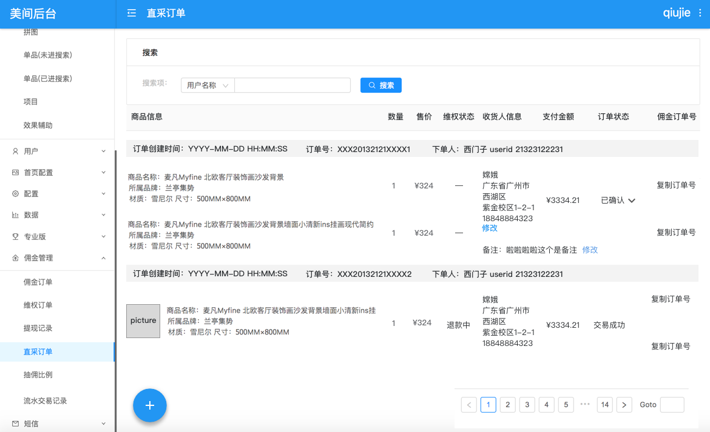
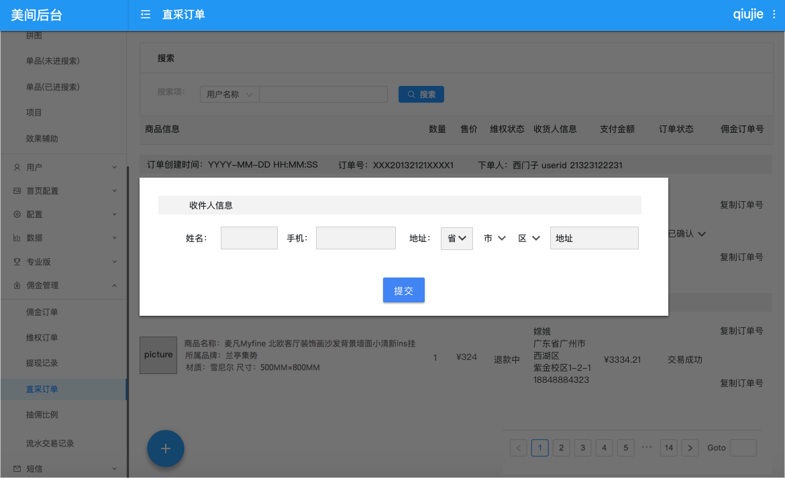
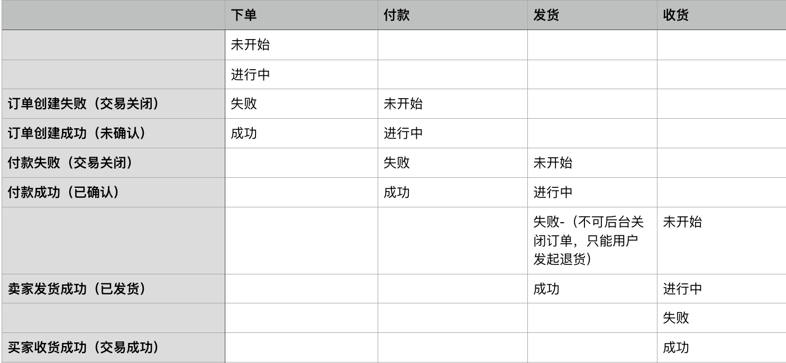
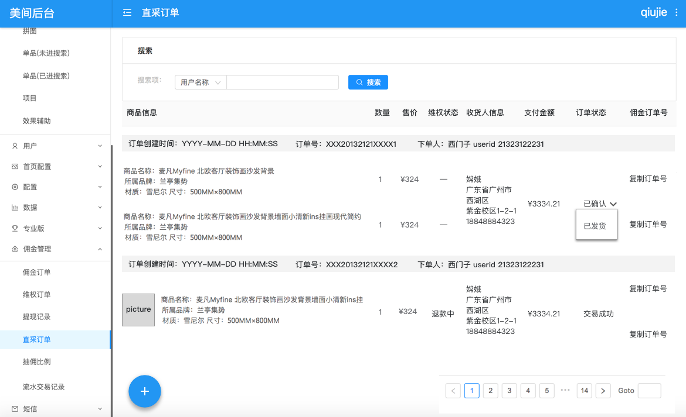

# 4.3 直采订单（正向）

## 4.3.1 直采订单展示（P1）

**功能模块**：CMS

**功能说明**：后台需要将直采订单信息展示成列表。本段主要说明直采订单的列表结构和字段含义。

* 直采订单为父订单，可包含多个商品。
* **订单字段：**

| 模块 | 解释 | 字段 | 类型 | 备注 |
| --- | --- | --- | --- | --- | --- | --- | --- | --- | --- | --- | --- | --- | --- | --- | --- | --- | --- | --- | --- | --- | --- | --- | --- | --- | --- |
| 订单信息 | 直采订单ID | order\_id | String |  |
|  | 订单创建时间 （用户下单时间） | time | Int /YYYY-MM-DD HH:MM:SS |  |
|  | 订单支付时间 | pay\_time | Int | 当前同确认时间 |
|  | 订单确认时间 | confirm\_time | Int |  |
|  | 下单人 | user\_id | String |  |
|  | 订单状态 \*a | status | String |  |
|  | 邮费价格 | Express\_amount | Double | 目前一般是包邮，默认0元 |
|  | 订单支付价格 | pay\_amount | Double | 用于给用户支付的一个总金额 |
| 商品信息 | 商品列表 | Item\_list | Array |  |
|  | 商品ID | item\_id | String |  |
|  | 商品名称 | item\_name | String |  |
|  | 商品规格 | material+size | String | 材质 加上尺寸，合并一个文字200字以内 |
|  | 品牌页ID | brand\_id | String |  |
|  | 品牌页名称 | brand\_name | String |  |
|  | 购买数量 | qty | Double |  |
|  | 商品售价 | price | String |  |
|  | 单件商品实际支付价格 | pay\_price | Double | 目前不可修改，同商品售价 |
|  | 单件商品实际结算价格 | count\_price | Double | 用于结算佣金 |
|  | 维权状态\*b | refund\_status | String |  |
| 收件人信息 | 收件人姓名 | receiver\_name | String |  |
|  | 收件人电话 | receiver\_phone | String |  |
|  | 收件人地址 | receiver\_address | String |  |
|  | 省 | province | String |  |
|  | 市 | city | String |  |
|  | 区 | district | String |  |

以上所有Double类型的数字四舍五入到两位小数。

**a.直采订单状态：**

| 订单状态（status） | 说明 |
| --- | --- | --- | --- | --- | --- |
| 未确认 | unconfirmed |
| 已确认 | confirmed/付款成功 |
| 已发货 |  |
| 交易成功 | 已收货 |
| 交易关闭 | 取消和全部退货成功的都是关闭 |

**b.单个商品的维权状态:**

| 维权状态（refund\_status） | 说明 |
| --- | --- | --- | --- | --- |
| 无维权 |  |
| 退款中 |  |
| 退款成功 |  |
| 取消维权 |  |

* 直采订单状态变更为交易成功前，维权退款金额最终结算到单件商品的结算金额中。
* 直采订单状态变更为交易成功后，维权退款金额另外计算到维权订单中，需要进行佣金补扣 查看4.7。

**demo：**

## 4.3.2 直采订单手动创建、修改、查找（P1）

**功能模块**：CMS

**功能说明**： 后台支持手动创建订单，为用户下单、修改订单信息，查找导出订单的功能。

* 点+开始新建订单

具体说明

| 对象 | 说明 |
| --- | --- | --- | --- | --- | --- | --- | --- | --- | --- | --- | --- | --- | --- |
| 表单名称 | 新建订单 |
| 用户信息 | **输入用户手机号或昵称点击添加后，立刻提交检查，是已注册并且已经认证的佣金用户。否，则错误提示。** |
| 商品信息 | 1. 输入单品id和数量，点击添加，生成一行记录。 |
|  | 2. 用单品id查询商品的名称 品牌 材质 尺寸 价格，并展示出来。 |
|  | 3. 计算总价：商品售价\*数量的和加上邮费。 |
|  | 4. 输入后支持修改数量，邮费，支持删除一行记录。邮费支持两位小数和数量支持两位小数。 |
|  | 5. 商品售价和总价不可修改。 |
| 收件人信息 | 1.添加收件人信息：姓名、手机 、省市县地址（采用物流模板）。 |
|  | 2. **提交后只有未确认和已确认的订单允许收件人信息支持再次修改。直接在订单中点击对应信息 弹窗修改**。 |
| 提交订单 | 需要检查以下下内容： |
|  | 1.用户手机号已注册已认证，已经认证为佣金用户。 |
|  | 2.至少包含一行商品信息 |
|  | 3.收件人所有信息必填，不可为空。 |

* 提交后的订单状态为未确认。

**demo**：

* 提交订单后修改收件人信息

**查找订单**

* 创建时间 ：订单创建时间段
* 用户昵称：全文匹配
* 用户手机号 ：全文匹配

**筛选订单**

* 品牌 ：（佣金订单列表里一样的筛选方式）

以上查无结果时，就toast提示。

**导出订单**

* 在当前筛选条件下导出订单时，订单中所有字段信息
* 增加每个单品的采购价和佣金订单ID

## 4.3.3 直采状态变更（P1）

**功能模块**：CMS

**功能说明**：直采订单的订单状态在后台进行手动变更的方法。

`以下内容格式为：`

* `当前状态`
  * `可变更状态1`
  * `可变更状态2`

so，

* 未确认
  * 已确认
  * 交易关闭
* 已确认
  * 已发货
* 已发货
  * 交易成功

**系统支持的正向状态变更说明：  表头横列为行为， 纵列为订单状态** 

**手动更改订单状态交互** ：点下状态后，给出相应的可选择状态，选择后弹窗**二次确认**，确认后进行变更状态。

**demo**：

* 每次提交维权订单状态为退款成功时，都会检查其商品所在直采订单的状态，若所有商品维权状态都是退款成功，将直采订单状态更改为交易关闭。 具体查看4.4

## 4.3.4 直采订单中“单件商品的实际结算价格”计算（P1）

**功能模块**：CMS

**功能说明**：这是一个维权状态变更时会触发的任务。

根据每个商品的维权状态，查看。

* 若商品无维权，实际结算价格=实际支付价格
* 若商品有维权，则实际结算价格=实际支付价格-退款金额

  

