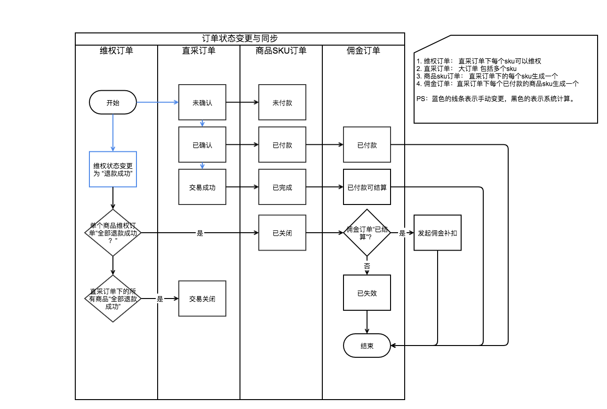
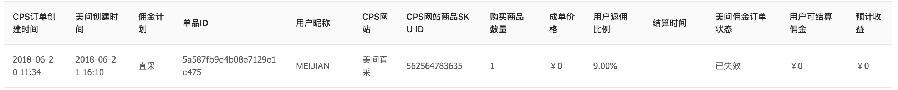

# 4.5 佣金订单生成

## 4.5.1 用户佣金管理中佣金订单查看（P1）

**功能模块**：web、phone

**功能描述**：

* 将佣金订单中的联系美间客服更改为联系佣金订单的客服，详见4.2.3
* 订单中照常展示所有该用户的佣金订单

## 4.5.2 佣金订单生成（P0）

**功能模块**：cms

**功能描述**：

* 当美间直采订单状态为已确认时，进行对应佣金订单生成。
* 每个直采订单下，同一个SKU对应一个佣金订单。
* 佣金订单重点包括成单价格和返佣比例，并根据直采订单和其中商品的维权状态生成佣金订单。
* 佣金订单生成后不断更新。

**A.成单价格：**

使用“单件商品的实际结算价格“，若为空时，采用已付款订单中的“单件商品实际支付价格“。

**B.返佣比例：**

商品配置的返佣比例

**C.佣金订单状态：**

直采订单状态为未确认，不生成佣金订单。

若单个商品当维权状态为全额退款成功，则该佣金订单状态为已失效。

* **佣金订单中其他字段信息**： 

订单创建时间填入美间直采订单创建时间，美间创建时间还是佣金订单创建时间，

佣金计划为直采，cps网站为 美间直采， 美间订单状态文案改为“美间佣金订单状态“

订单类型为A，用户可以拿到钱。

用户可结算佣金计算方式看下文。

**demo：**

## 4.5.3 佣金订单结算（P0）

**功能模块**：cms

**功能描述**：

结算日进行佣金订单状态的最后一次更新，并且再一次计算佣金，将佣金订单中已收货可结算订单更新为已结算，用户可提现对应订单的佣金金额。

按照每个单品的实际结算价格进行佣金的结算。

**佣金订单：**

1. 成单价格：单件商品的实际结算价格
2. 返佣比例：订单中记录的返佣比例

**结算前置条件：**更新后的订单状态为“已收货可结算“。

| 佣金金额=\[实际结算价格\*（1-1\*1.03\*0.03\*1.12）-采购价\]\(1-美间直采抽佣比例\) |
| --- |

直采订单状态变更为交易成功后，维权退款金额另外计算到维权订单中，需要进行佣金补扣，**详细参考4.7。**

