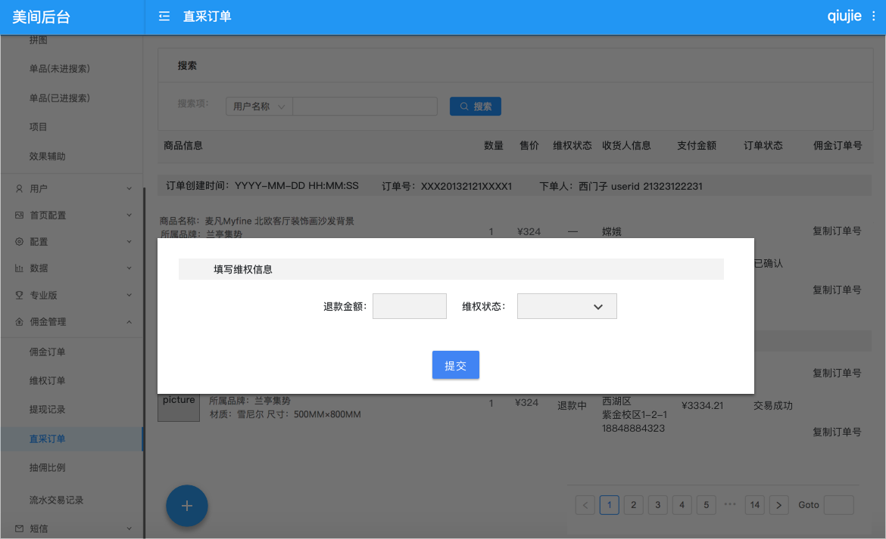

# 4.4 直采维权订单（逆向）

## 4.4.1 直采维权订单创建（逆向）

**功能模块**：CMS

**功能描述**：每个订单中的商品包括一个维权状态，退货时创建维权订单。

**前置条件**：直采订单状态不是“未确认“。

维权订单有以下字段组成

| 字段名 | 字段 | 类型 | 说明 |
| --- | --- | --- | --- | --- | --- | --- |
| 商品id | item\_id | String |  |
| 商品所在直采订单id | order\_id | String |  |
| 维权订单创建时间 |  |  |  |
| 维权订单完成时间 |  |  |  |
| 退款金额 | refund\_price | Double | \[0，直采订单中该订单的实际支付金额\] |
| 维权状态\*c | refund\_status | String |  |

| c.维权状态（refund\_status） | 说明 |
| --- | --- | --- | --- | --- | --- |
| 无维权 |  |
| 退款中 |  |
| 部分退款成功 | 当输入金额小于实际支付金额时，点击退款成功，维权状态标记为部分退款成功 |
| 全额退款成功 | 当输入金额等于实际支付金额时，点击退款成功，维权状态标记为全额退款成功 |
| 取消维权 |  |

* 创建交互：点击要维权的商品后的维权信息，弹窗，输入退款金额，维权状态，点击提交。提交时检查提交信息不能为空。
* 点叉叉或窗口外部关闭窗口，则取消本次创建流程。
* 当状态变更提交已退款时，同时提交退款金额，不可再修改

 

退款金额：退款金额手工输入，placeholder显示文案 最高¥XXX（显示单品实际支付金额）。 

维权状态：可以选择顺序选择 退款中，已退款，取消维权。

> * 当前状态
>   * 可变更状态1
>   * 可变更状态2

* 退款中
  * 已退款
  * 取消维权
* 已退款
  * 取消维权

手工标记已退款后，页面中状态展示最后的维权状态。

**demo：** 

## 4.4.2 维权订单影响 直采订单状态变更（P1\)

**功能模块**：CMS

**功能描述**：每次变更维权订单状态时进行检查，当商品所在当直采订单中全部当商品维权状态为全额退款成功时，将直采订单状态修改为交易关闭。

