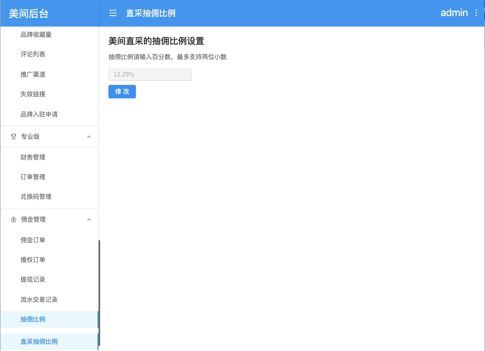

# 4.8 美间直采抽佣比例

**功能模块：**CMS

**功能描述：**

“配置”下增加一个菜单，和对应的后台权限，设置直采的抽佣比例。

* **初始状态** 美间抽佣比例初始状态设置为0。
* **“修改”按钮** 进入页面，“修改”按钮为“可点击”状态，“抽佣比例输入框”为不可更改的状态。 若点击“修改”按钮，则由一个“修改”按钮变更为“取消修改”与“保存”按钮，“抽佣比例输入框”变为“可输入”状态。 
* **“取消修改”按钮** 若点击“取消修改”按钮，则“直采抽佣比例输入框”变为“不可更改”状态，按钮变更回一个“修改”按钮，且输入框内的数值恢复上次保存的内容。
* **“保存”按钮** 若点击“保存按钮，则先本地判断输入的抽佣比例是否为数字，且范围为\[0,1\]，若是，则发起网络请求。 保存成功后，则恢复“修改”按钮与“不可修改”的输入框。

| if | 交互 |
| --- | --- | --- | --- | --- |
| 抽佣比例输入的为空，非数字、范围非\[0,1\] | 弹窗提示“请输入正确的抽佣比例”，且停留在原页面不做任何改变 |
| 网络请求失败 | 弹窗提示“网络不稳定，请重新保存”，且停留在原页面 |
| 接口返回失败或error | 弹窗提示“保存失败，请重试”，且停留在原页面 |
| 接口返回成功 | 弹窗提示“保存成功”，且停留在原页面 |

* **直采抽佣比例设置更改后的影响** 美间直采抽佣比例修改后，若美间订单创建时间晚于美间抽佣比例修改时间，则该笔订单按最新的美间抽佣比例进行佣金计算。对之前创建的订单佣金不影响。

**demo：**

