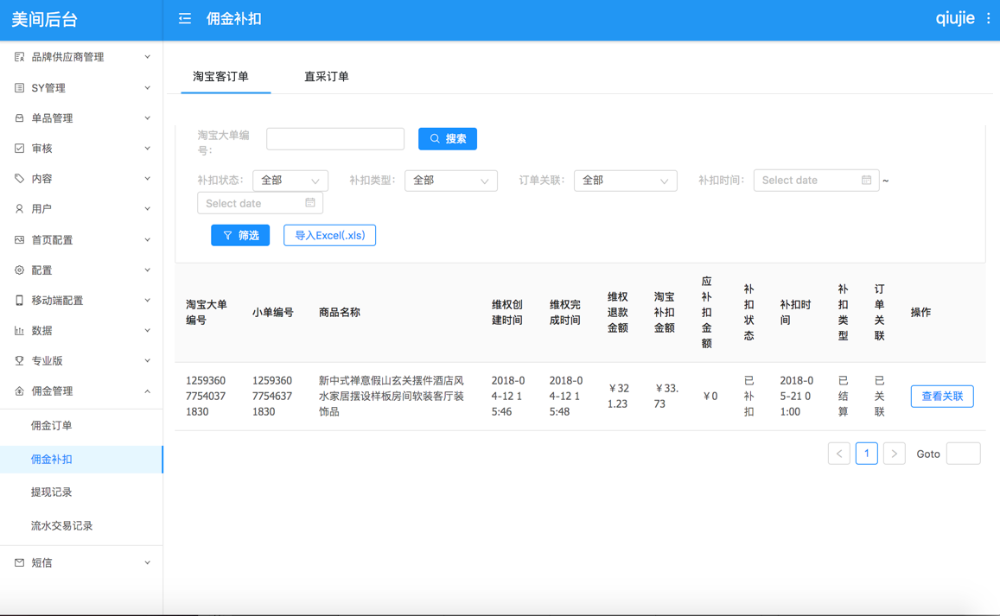
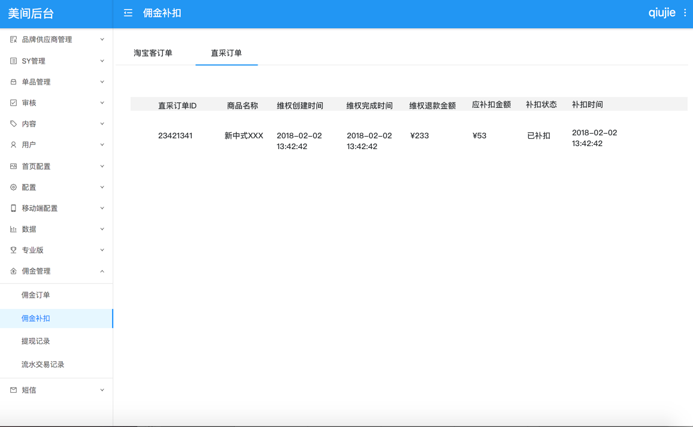

# 4.7 佣金补扣

## 4.7.1 佣金补扣

**功能模块**：CMS

**功能说明**：直采订单状态变更为交易成功后，若再发生维权，其产生的退款金额需要进行维权补扣 。后台原来的“维权订单“改名为“佣金补扣“。

佣金补扣订单中新增一个列表，专门展示直采订单中退款产生的佣金补扣记录。

每个月结算时，将对应下单用户的佣金可提现金额减去补扣金额。补扣后，补扣状态修改则修改为已补扣。

**计算方式**：

```text
应补扣金额=退款金额*返佣比例
```

补扣后生成的补扣记录展示在佣金补扣列表中

| 补扣订单列表信息 | 说明 |
| --- | --- | --- | --- | --- | --- | --- | --- | --- |
| 直采订单ID | 单品所在的直采订单的父订单号 |
| 商品名称 |  |
| 维权创建时间 |  |
| 维权完成时间 |  |
| 退款金额 | 商品的维权订单的退款金额 |
| 应补扣金额 | 退款金额\*返佣比例 |
| 补扣状态 | 已补扣、未补扣 |
| 补扣时间 | 结算时间 |


**demo**：





