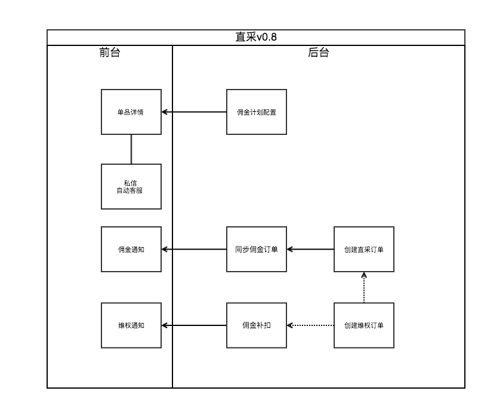
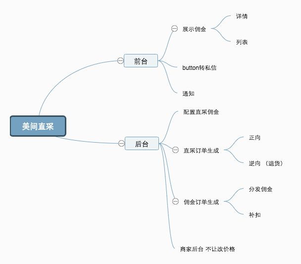

# 3. 产品概要

## 3.1名词说明

| 名称 | 解释 |
| --- | --- | --- | --- | --- | --- | --- |
| 直采 | 产品名，这个方案就叫这个名字，具体类似代销类似外包，指用户把钱付给美间的一种销售方式。属于一种佣金计划。 |
| 佣金计划 | 对品牌配置的一套计划，包括品牌合作方案和各个分类的抽佣金比例。 |
| 直采订单 | 配置为直采佣金计划的品牌下所产生的订单。 |
| 佣金订单 | 给用户返佣的订单，从直采订单或淘宝客订单中同步出来的。 |
| 直采维权订单 | 在用户直采后产生的退货退款逆向订单。 |
| 佣金补扣 | 将淘宝维权订单和直采维权订单导入并匹配已发放或将要结算的佣金订单中的行为。（请将以前的后台的“维权订单“改名叫“佣金补扣“） |

## 3.2 产品概述

美间要做一个用户可以点击直接购买，有收货地址，订单信息的toD的代销电商，返点比例会高，销量和抽佣会更高。

## 3.3 产品roadmap

首先，完成佣金计划的配置；直采订单创建，对应佣金订单转化；维权订单创建，佣金订单中维权订单的匹配。

通过运营人力去实践填补咨询，交易，分子订单，采购，物流环节。

然后，如果效果理想，增加交易体系，订单信息，物流信息的展示，包括建立用户的地址库，接品牌的erp等。

如果效果不理想，品牌回到淘宝客。

最后，增加产品透出，将直采产品从搜索，展示等方面突出到可见层面来推广；增加产品分享的佣金的方式。

## 3.4 产品风险

运营风险已从品牌选择，人员安排等方面，进行了规避。

试点品牌可米在北京，兰亭集势在中山，星川在宁波，三个品牌在淘宝客订单销量，单品数量等方面都比较综合。品类为灯具挂画饰品等。增加品牌GRADO，家具品类。

目前，产品上可能会产生的风险有：

1. 直采的订单暂时不提供分享佣金，在用户的访谈中有发现用户对分享更感兴趣，但目前淘宝客订单数量不足矣支撑这个论点。
2. 试点如果失败，产品终止提供后这些订单后，已转化的佣金订单不可清理，直采类型需要保留。
3. 原来运营中配置的联系人要改成客服，这些联系人在品牌中暂时没有地方展示。

## 3.5 流程图

## 3.6 产品结构图

